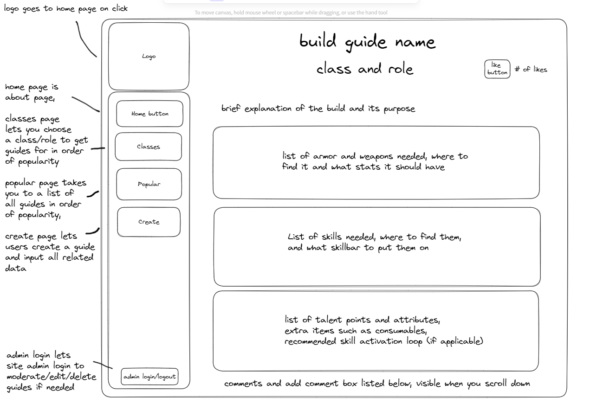
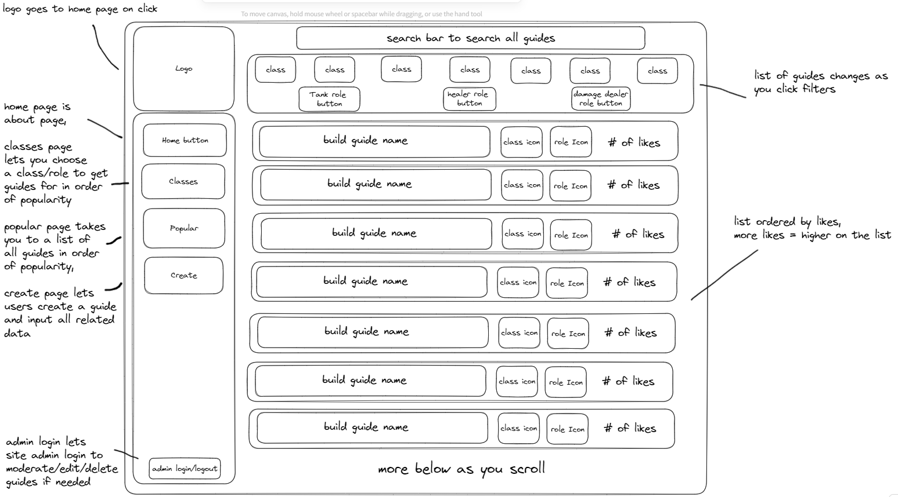
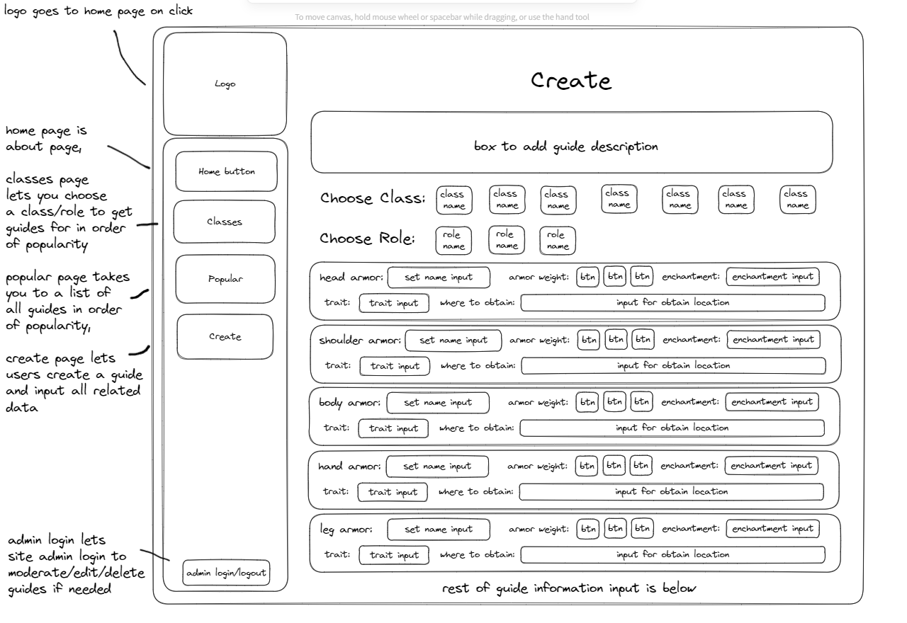

# Game-Guide-for-ESO
- [Click to go to API Repository](https://github.com/amarynn/Game-Guide-For-ESO-API)
- An app for users to create, store and view builds/guides for The Elder Scrolls Online.

## :computer: [Click here](https://fortress-eso-guides.onrender.com/) to see my live project!

## :page_facing_up: About
- A homepage with info about the site, with links to twitch if you want to watch livestreams of the game, and a link to the official website if you need to visit it.
- The Search page has filters for you to filter the page results, and a search bar to further filter the results, listing them all in a neat manner.
- A Popular page to display all guides in order of popularity, with guides that have more likes showing higher on the list, and guides with less likes showing lower on the list.
- The create page has fields for the user to put in all info nessecary to create a new guide for users to view and interact with and saves it in the database.

## :pencil2: Planning & Problem Solving
- Initial plans for some of my pages

- The above is my initial design plan for my guide page, which displays to the user a specific guide that they clicked on to view all the information it has.

- The Above wireframe is my initial plan for what is now my search page, with filters at the top of the page and a search bar to search guides.

- The above is my beginning idea of a design for what is now the Create page.
- [Click to go to trello user stories](https://trello.com/b/6fCYEAni/game-guides-eso)
- I came across a few problems while building the app, one of which is the large amount of data required to have an accurate guide for the user. Handling all this data meant that a few of my files became very large and it was a little difficult to traceback errors. For example, one error I encountered was when I was trying to use a post request to create a new guide in the database, but the server kept throwing an error saying it was accessing more target columns than data it was recieving. I eventually found the issue to be string quotes mistakenly placed around the data I was passing into the INSERT, and when removed, it worked as intended.

## :star2: Potential Improvements
- The search bar could alter the results on the page even as you backspace, instead of only altering the results while you type.
- The sites ui isn't overly professional and looks relatively basic and could do with some changes to improve it.

## :rocket: Cool tech
- The Search page is able to automatically filter your results based on the current search bar and also the currently selected class and role filters.
- Adding a comment to a guide automatically puts it at the top of the list of comments, so the viewer can immediately see that their comment has been added to the list.

## :beetle: Bugs to fix
- No currently known bugs

## :notebook: Lessons learnt
- When redeploying to a new url, check that environment variables are available for the app to use, otherwise if you forget and later try to use it, you may end up struggling to find why your site isn't working and not realizing its missing those key hidden variables.

## :white_check_mark: Future Features
- A Tips and Tricks page could be added to include in-game settings suggestions and even addon suggestions to improve the users experience with the game and ease their introduction.
- It would be useful for users to also have a wiki-like page where they could look for information about equipment or dungeons and other content to assist them in being successful with it.